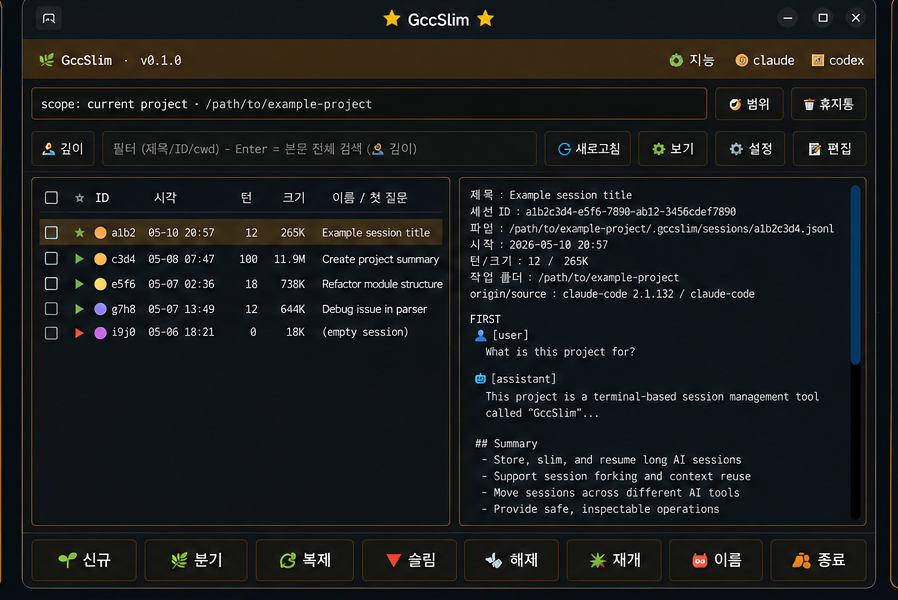
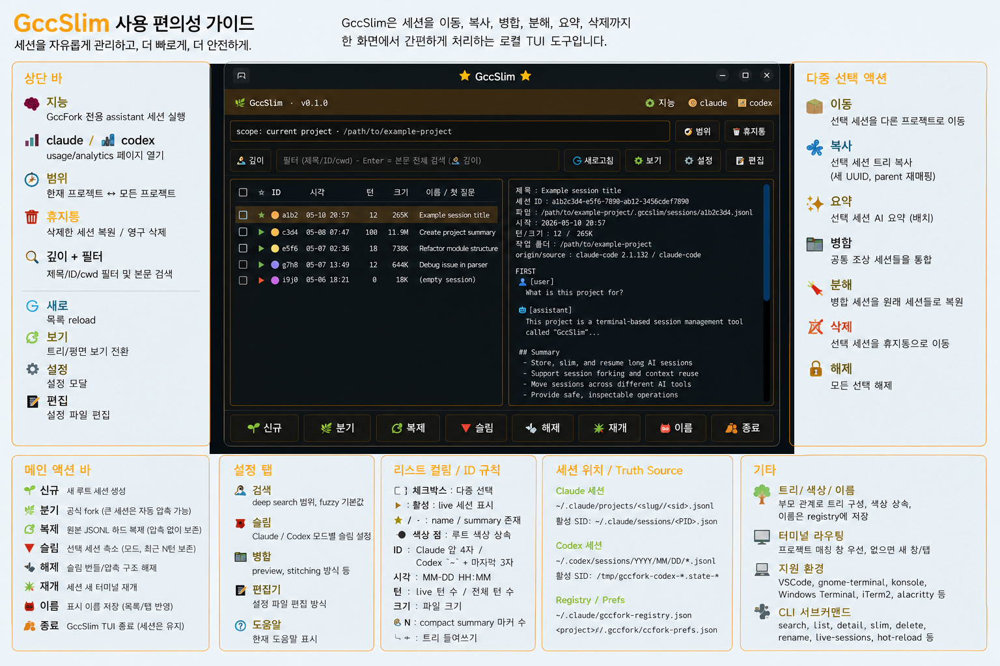

# GccSlim

현재 배포 버전: `v2026.05.26.1`

Claude Code나 Codex CLI를 쓰면서, 이런 적 없으셨나요?

- 세션 이름이 알 수 없는 ID라서 **"그 대화 어디 갔더라?"** 하고 한참 헤맨 적
- 지금 세션에 **제대로 된 이름**을 붙여두고 싶었던 적
- 지금 세션을 **그대로 복제**해서, 원본은 두고 다른 방향으로 실험해보고 싶었던 적
- Claude Code에서 하던 세션을 **그대로 Codex로 넘겨서** 이어가고 싶었던 적
- 프로젝트마다 흩어진 세션을 **한 화면에서 보고 정리**하고 싶었던 적

**GccSlim은 바로 그걸 해주는 터미널 앱입니다.** 흩어진 Claude Code·Codex 세션을 한곳에서 관리하세요 — 이름 붙이기, 복제, 이동, 병합·분할, 그리고 Claude ↔ Codex 넘기기까지.

> 💡 기본 터미널에는 GccSlim을 세션 관리자로 띄워두고, 고른 세션은 VS Code 터미널에서 바로 열 수 있습니다. 한쪽에선 세션을 고르고, 다른 쪽에선 그 세션으로 작업하세요.

_(덤으로, 너무 커진 세션은 "슬림"으로 가볍게 줄일 수도 있습니다 — 최근 작업은 그대로 두고 오래된 무거운 부분만 잘라내, 새로 시작하지 않아도 다시 가벼워집니다.)_



<sub>모든 기능을 한 화면에:</sub>



## 언어 선택

GccSlim은 **한국어판**과 **영어판**을 별도로 배포합니다. [최신 release](https://github.com/insung8150/GccSlim/releases/latest)에서 본인 언어와 플랫폼에 맞는 자산을 받으세요.

| 언어 | 플랫폼 | 자산 |
|---|---|---|
| 한국어 | Linux x86_64 | `gccslim-ko-linux-x86_64-<버전>.tar.gz` |
| 한국어 | macOS arm64 | `gccslim-ko-macos-arm64-<버전>.tar.gz` |
| 영어  | Linux x86_64 | `gccslim-en-linux-x86_64-<버전>.tar.gz` |
| 영어  | macOS arm64 | `gccslim-en-macos-arm64-<버전>.tar.gz` |

```bash
# Linux 한국어판
tar xzf gccslim-ko-linux-x86_64-*.tar.gz
cd gccslim-ko-linux-x86_64-*
bash install.sh
gccslim    # 한국어 UI

# Linux 영어판
tar xzf gccslim-en-linux-x86_64-*.tar.gz
cd gccslim-en-linux-x86_64-*
bash install.sh
gccslim    # 영어 UI
```

**언어 전환**

두 언어판 모두 `~/.local/bin/gccslim` 한 경로에 설치됩니다. 언어를 바꾸려면 반대 언어 tarball을 받아 `install.sh`를 다시 실행하면 됩니다. 바이너리를 덮어쓰고 `~/.local/share/gccslim/default-language` 값도 함께 갱신됩니다.

설정 패널의 `Language` 라디오는 일부 라벨만 즉시 새 언어로 갱신합니다. 모든 UI를 완전히 전환하려면 반대 언어 tarball을 다시 설치해야 합니다.

English readme: [README.md](README.md)

## 실행

설치 없이 실행:

```bash
./bin/gccslim
```

`~/.local/bin`에 설치:

```bash
./install.sh
gccslim
```

현재 Claude 세션 슬림 명령:

```bash
gccslim-now
```

이번 배포본이 설치하는 Codex helper 명령:

```bash
codex-slim-loop
codex-slim-now
```

## Claude Code와 어떻게 연동되나

GccSlim은 Claude Code의 공식 확장 지점만 사용하고, 바꾸는 것은 모두 선택적·되돌림 가능합니다:

- `/slim` 명령은 Claude Code의 공식 훅으로 동작합니다 — 설치하면 `~/.claude/settings.json`에 한 줄만 추가되고, 언제든 제거할 수 있습니다.
- 슬림은 **본인의 세션 파일만** 고칩니다. Claude Code 본체는 건드리지 않으며, 원본은 복원 가능한 휴지통으로 갑니다.
- 원하면 슬림 직후 실행 중인 세션을 Claude의 공식 resume 명령으로 새로고침할 수 있습니다. 선택 사항이고 되돌릴 수 있으며, 이 기능 없이도 슬림은 동작합니다.
- 모든 처리는 로컬에서 이뤄집니다. 로그인·사용량 한도·과금을 건드리지 않고, 외부로 아무것도 전송하지 않습니다.

## 포함 항목

- `bin/gccslim`: 공개 TUI 실행 파일.
- `bin/gccslim-now`: 현재 Claude 세션을 직접 슬림 처리하는 wrapper.
- `bin/gccslim-slim`: 플랫폼을 자동 선택하는 슬림 wrapper.
- `bin/gccslim-claude-patch`: 플랫폼을 자동 선택하는 Claude patch wrapper.
- `bin/codex-slim-loop`: Codex 같은 터미널 슬림/재시작 wrapper.
- `bin/codex-slim-now`: Codex 활성 세션 슬림 요청 helper.
- `bin/gccfork_codex_slim_loop.py`: Codex wrapper loop sidecar.
- `bin/gccfork_codex_slim_reload.py`: Codex JSONL slim plan/apply sidecar.
- `bin/linux-x86_64/`: strip 처리된 Linux x86_64 Rust 바이너리.
- `bin/macos-arm64/`: strip 처리된 macOS arm64 Rust 바이너리.
- `bin/gccfork_*.py`: 내부 호환 이름을 유지한 Python sidecar.
- `share/gccslim/brain-system-prompt.md`: sanitize 된 런타임 프롬프트.

일부 내부 dispatch 경로가 아직 legacy 이름을 호출하므로 `gccfork-slim`, `gccfork-claude-patch` 호환 wrapper도 포함합니다.

## 배포본 안내

이 저장소는 내부 개발 소스 트리가 아니라 **바이너리 배포본**입니다. Rust 코어는 strip된 바이너리로 제공되고, Python 계층·설치 스크립트·통합 코드는 소스로 포함됩니다. 의도적으로 제외한 것:

- Rust 소스 코드.
- Rust 테스트와 내부 회귀 fixture.
- 개인 세션 로그.
- 로컬 `.claude`, `.codex`, `.gccfork` 상태 파일.
- 내부 한글 작업 로그와 세션 이관 문서.
- SSH, 호스트명, IP, 개인 절대경로가 들어간 문서.

## 라이선스

MIT License. 자세한 내용은 `LICENSE`를 확인하세요.
