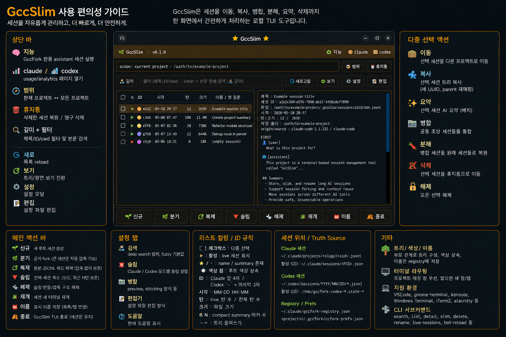

# GccSlim

현재 배포 버전: `v2026.05.26.1`

GccSlim은 Claude Code와 Codex CLI 세션을 로컬에서 관리하고 슬림 처리하기 위한 배포본입니다.

이 폴더는 내부 개발 소스 트리가 아니라 **바이너리 배포 staging**입니다. Rust 구현 소스, 회귀 테스트, 개인 작업 기록, 로컬 세션 파일, 장비명, IP, 개인 절대경로는 의도적으로 제외합니다.



## QR

이 QR 코드를 스캔하면 GitHub 저장소가 열립니다.


## 언어 선택

GccSlim은 **한국어판**과 **영어판**을 별도로 배포합니다. [최신 release](https://github.com/insung8150/GccSlim/releases/latest)에서 본인 언어와 플랫폼에 맞는 자산을 받으세요.

| 언어 | 플랫폼 | 자산 |
|---|---|---|
| 한국어 | Linux x86_64 | `gccslim-ko-linux-x86_64-<버전>.tar.gz` |
| 한국어 | macOS arm64 | `gccslim-ko-macos-arm64-<버전>.tar.gz` |
| 영어  | Linux x86_64 | `gccslim-en-linux-x86_64-<버전>.tar.gz` |
| 영어  | macOS arm64 | `gccslim-en-macos-arm64-<버전>.tar.gz` |

```bash
# Linux 한국어판
tar xzf gccslim-ko-linux-x86_64-*.tar.gz
cd gccslim-ko-linux-x86_64-*
bash install.sh
gccslim    # 한국어 UI

# Linux 영어판
tar xzf gccslim-en-linux-x86_64-*.tar.gz
cd gccslim-en-linux-x86_64-*
bash install.sh
gccslim    # 영어 UI
```

**언어 전환**

두 언어판 모두 `~/.local/bin/gccslim` 한 경로에 설치됩니다. 언어를 바꾸려면 반대 언어 tarball을 받아 `install.sh`를 다시 실행하면 됩니다. 바이너리를 덮어쓰고 `~/.local/share/gccslim/default-language` 값도 함께 갱신됩니다.

설정 패널의 `Language` 라디오는 일부 라벨만 즉시 새 언어로 갱신합니다. 모든 UI를 완전히 전환하려면 반대 언어 tarball을 다시 설치해야 합니다.

English readme: [README.md](README.md)

## 실행

설치 없이 실행:

```bash
./bin/gccslim
```

`~/.local/bin`에 설치:

```bash
./install.sh
gccslim
```

현재 Claude 세션 슬림 명령:

```bash
gccslim-now
```

이번 배포본이 설치하는 Codex helper 명령:

```bash
codex-slim-loop
codex-slim-now
```

## 포함 항목

- `bin/gccslim`: 공개 TUI 실행 파일.
- `bin/gccslim-now`: 현재 Claude 세션을 직접 슬림 처리하는 wrapper.
- `bin/gccslim-slim`: 플랫폼을 자동 선택하는 슬림 wrapper.
- `bin/gccslim-claude-patch`: 플랫폼을 자동 선택하는 Claude patch wrapper.
- `bin/codex-slim-loop`: Codex 같은 터미널 슬림/재시작 wrapper.
- `bin/codex-slim-now`: Codex 활성 세션 슬림 요청 helper.
- `bin/gccfork_codex_slim_loop.py`: Codex wrapper loop sidecar.
- `bin/gccfork_codex_slim_reload.py`: Codex JSONL slim plan/apply sidecar.
- `bin/linux-x86_64/`: strip 처리된 Linux x86_64 Rust 바이너리.
- `bin/macos-arm64/`: strip 처리된 macOS arm64 Rust 바이너리.
- `bin/gccfork_*.py`: 내부 호환 이름을 유지한 Python sidecar.
- `share/gccslim/brain-system-prompt.md`: sanitize 된 런타임 프롬프트.

일부 내부 dispatch 경로가 아직 legacy 이름을 호출하므로 `gccfork-slim`, `gccfork-claude-patch` 호환 wrapper도 포함합니다.

## 제외 항목

- Rust 소스 코드.
- Rust 테스트와 내부 회귀 fixture.
- 개인 세션 로그.
- 로컬 `.claude`, `.codex`, `.gccfork` 상태 파일.
- 내부 한글 작업 로그와 세션 이관 문서.
- SSH, 호스트명, IP, 개인 절대경로가 들어간 문서.

## 라이선스

MIT License. 자세한 내용은 `LICENSE`를 확인하세요.
