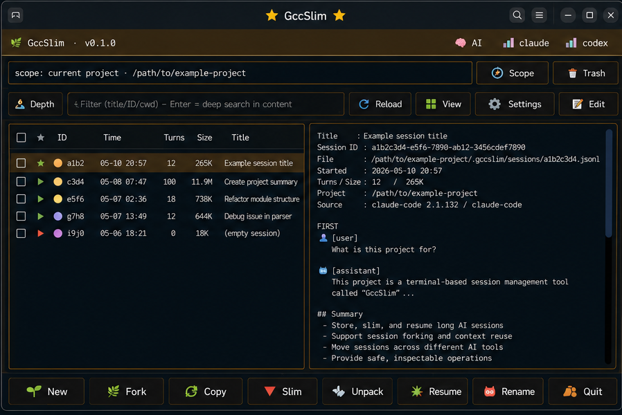
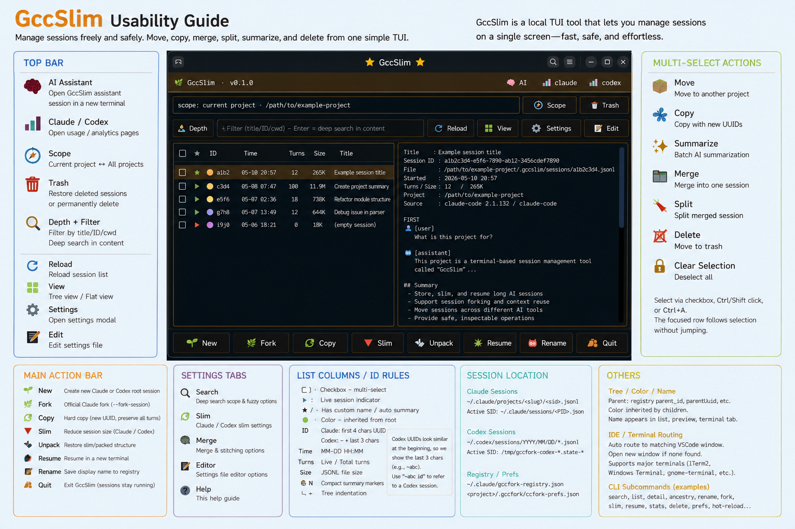

# GccSlim

Current release: `v2026.05.26.1`

If you use Claude Code or Codex CLI, have you ever:

- lost track of a conversation because the session is just a random ID — and wished you could **give it a real name**?
- wanted to **duplicate a session as-is** to try another direction while keeping the original?
- wanted to take a session you started in Claude Code and **hand it straight to Codex** to keep going?
- wished you could see every session scattered across projects **in one place** and tidy them up?

**That's what GccSlim is for.** Manage all your Claude Code and Codex sessions from one terminal UI — name them, duplicate them, move them, merge/split them, and pass them between Claude Code and Codex.

> 💡 Keep GccSlim open as your session manager in your main terminal, and open any session you pick straight into your VS Code terminal. Browse and pick on one side, work the session on the other.

_(And when a session gets too big, you can "slim" it down too — trim the old, heavy parts while keeping your recent work, so it's fast again without starting over.)_



<sub>Every feature on one screen:</sub>



## Install

GccSlim is for Claude Code / Codex users — so let your agent install it. Paste this into Claude Code or Codex:

> Clone github.com/insung8150/GccSlim, check the scripts for anything unsafe, then run install.sh.

It clones the repo, looks it over, and installs to `~/.local/bin`. Then run:

```bash
gccslim
```

English and Korean UIs are both included. Prefer to do it by hand or want a prebuilt tarball? See the [latest release](https://github.com/insung8150/GccSlim/releases/latest).

한국어 안내는 [README.ko.md](README.ko.md).

## How it works with Claude Code

GccSlim sticks to Claude Code's official extension points, and anything it changes is optional and reversible:

- The `/slim` command works through Claude Code's official hook — installing it just adds one line to `~/.claude/settings.json`, and you can remove it anytime.
- Slimming only edits your own session files. It never changes Claude Code itself, and the originals go to a trash you can restore from.
- Optionally, it can refresh a running session right after slimming, using Claude's own resume command. This is opt-in and reversible; plain slimming works without it.
- Everything runs locally. It doesn't touch your login, usage limits, or billing, and nothing is uploaded.

## About this distribution

Nothing sketchy in here. The Rust core ships as a binary only to keep the Claude-Code-patching part out of public source — purely to stay on the safe side of Anthropic's terms, not because the code does anything harmful. Everything else (the Python layer, install scripts, and integration) is open in this repo.

## License

MIT License. See `LICENSE`.
