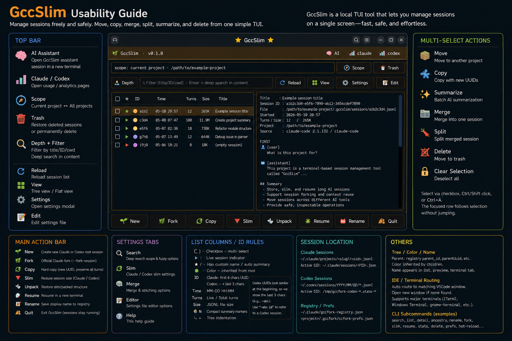

# GccSlim

GccSlim is a local session management and session-slimming distribution for Claude Code and Codex CLI workflows.

This staging folder is a **binary distribution**, not the internal development source tree. Rust implementation sources, regression fixtures, private work logs, local session files, hostnames, IP addresses, and personal paths are intentionally excluded.



## Run

Without installing:

```bash
./bin/gccslim
```

Install into `~/.local/bin`:

```bash
./install.sh
gccslim
```

Direct slim command:

```bash
gccslim-now
```

## Included

- `bin/gccslim`: public TUI entrypoint.
- `bin/gccslim-now`: direct slim wrapper for the active Claude session.
- `bin/gccslim-slim`: platform-selecting slim wrapper.
- `bin/gccslim-claude-patch`: platform-selecting Claude patch wrapper.
- `bin/linux-x86_64/`: stripped Linux x86_64 Rust binaries.
- `bin/macos-arm64/`: stripped macOS arm64 Rust binaries.
- `bin/gccfork_*.py`: Python sidecar modules kept under compatibility names.
- `share/gccslim/brain-system-prompt.md`: sanitized runtime prompt.

Compatibility wrappers named `gccfork-slim` and `gccfork-claude-patch` are included because some internal dispatch paths still call those legacy names.

## Not Included

- Rust source code.
- Rust tests or internal regression fixtures.
- Private session logs.
- Local `.claude`, `.codex`, `.gccfork` state.
- Internal Korean work logs and migration notes.
- Machine-specific SSH, hostname, IP, and absolute-path notes.

## License

MIT License. See `LICENSE`.
